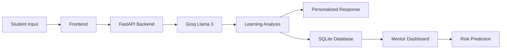

<div align="center">

# 🎓 Mentora AI
### AI-Powered Personalized Learning Assistant & Mentor Platform


**Learn Smarter • Teach Better • Empower Every Student 🎓**

</div>

---

## 📖 Overview

**Mentora AI** is an Agentic AI-powered learning platform that delivers personalized education using AI while helping mentors identify struggling students through intelligent analytics.

Built using **FastAPI**, **Python**, **Groq Llama 3**, **SQLite**, **HTML**, **CSS**, and **JavaScript**, the platform offers AI tutoring, summaries, quizzes, flashcards, concept maps, voice quizzes, and mentor analytics.

### 🎯 Goal

Support **United Nations SDG 4 – Quality Education** by making intelligent, personalized education accessible to every learner.

---

## ✨ Features

- 🤖 AI Tutor
- 📝 Smart Notes Summarizer
- ❓ Quiz Generator
- 🧠 Flashcards
- 🗺️ Concept Map Generator
- 🎙️ Voice Quiz
- 📖 ELI5 Learning Mode
- 🎓 Feynman Learning Checker
- 👨‍🏫 Mentor Dashboard
- 📊 Student Analytics
- 🚨 Dropout Risk Prediction
- 📱 Responsive Interface

---

## 🏗️ Architecture



---

## 🛠️ Tech Stack

| Component | Technology |
|------------|------------|
| Frontend | HTML, CSS, JavaScript |
| Backend | FastAPI |
| AI Model | Groq Llama 3 |
| API | Groq API |
| Database | SQLite |
| Deployment | Render |
| Security | Python Dotenv |

---

## 🚀 Installation

### Clone Repository

```bash
git clone https://github.com/YOUR_USERNAME/mentora-ai.git

cd mentora-ai
```

### Install Dependencies

```bash
pip install -r requirements.txt
```

### Configure Environment

Create a `.env` file

```env
GROQ_API_KEY=your_api_key_here
```

### Run Application

```bash
uvicorn app:app --reload
```

---

## 📸 Screenshots

### Login Page

(Add Screenshot)

### Student Dashboard

(Add Screenshot)

### Mentor Dashboard

(Add Screenshot)

### AI Tutor

(Add Screenshot)

---

## 🌍 SDG 4 Impact

| SDG Target | Contribution |
|------------|--------------|
| SDG 4.1 | Personalized learning |
| SDG 4.4 | Digital education |
| SDG 4.5 | Inclusive education |
| SDG 4.7 | Lifelong learning |

### Expected Impact

- 📚 Better learning outcomes
- 🎯 Personalized education
- 👨‍🏫 Reduced teacher workload
- 🚨 Early intervention for struggling students
- 🌍 AI-powered quality education

---

## 🔮 Future Enhancements

- 📱 Android App
- 💬 WhatsApp AI Tutor
- 📄 PDF Chat
- 📷 OCR Notes Scanner
- ☁️ Cloud Database
- 🌐 Multi-language Support
- 📊 Institution Analytics
- 🎙️ Voice Assistant

---

## 📂 Project Structure

```text
mentora-ai/
│
├── app.py
├── Dockerfile
├── README.md
├── requirements.txt
│
├── static/
│   ├── css/
│   │   └── style.css
│   │
│   ├── js/
│   │   ├── app.js
│   │   └── api.js
│   │
│   └── index.html
```

---

## 👨‍💻 Author

**Pritesh Patro**

**Generative AI & Agentic Systems Engineering Intern** at **Lenovo LEAP**

🔗 GitHub Repository: https://github.com/Pritesh-05/mentora-ai

🔗 LinkedIn: https://www.linkedin.com/in/pritesh-patro

🔗 Deployed Website (Render): https://mentora-ai-jyvi.onrender.com/

🔗 Lenovo LEAP Capstone 5 Repository: https://github.com/Pritesh-05/University-Central-Student-Portal-with-Virtual-Assistant

🔗 Lenovo LEAP Capstone 8 Repository: https://github.com/Pritesh-05/careerguide-ai

This project was developed as part of the **Lenovo LEAP Internship Program 2026**.

---

## 🙏 Acknowledgements

- Lenovo LEAP Internship Program
- Groq AI
- FastAPI
- Render
- SQLite
- United Nations SDG 4

---

<div align="center">

### 🎓 Learn Smarter. Teach Better. Empower Every Student.

Made with ❤️ for SDG 4: Quality Education

</div>
